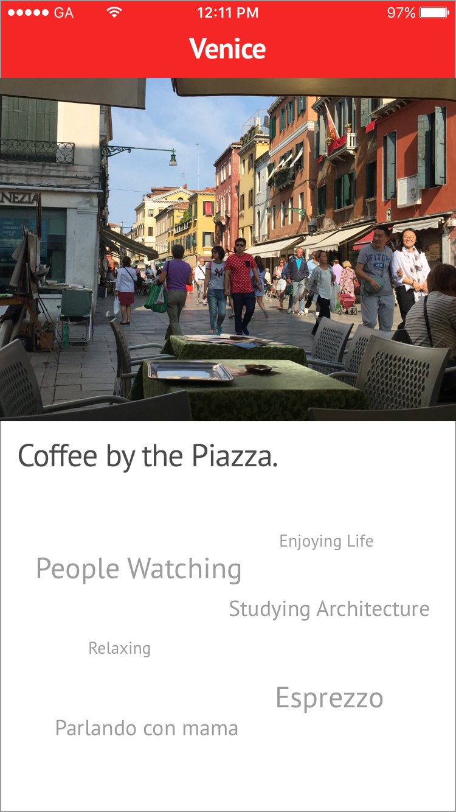
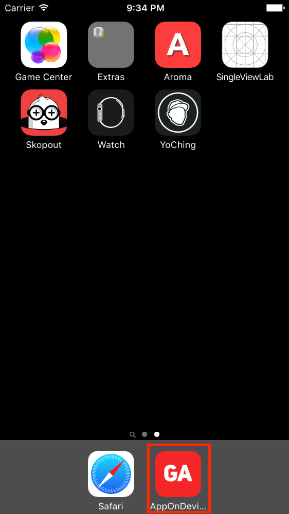
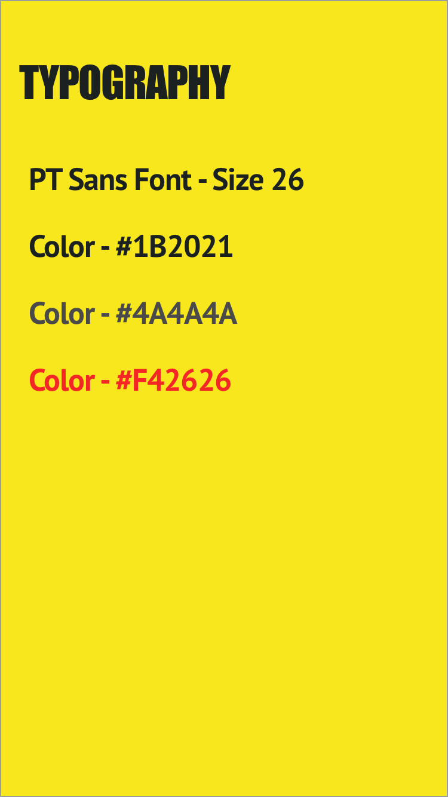

#  App On Device Lab

## Introduction

### What we are doing

In this lab, we will use Xcode to run an App on a real iOS Device. You will also practice setting an App's Icon and creating a Launch Screen.
> ***Note:*** _This can be done independently or a pair programming activity, especially for students who do not have real devices on-hand._

### Why we are doing it

On the job you will be expected to test your code on a real device before publishing it.
Not only does a real device give you the real *experience*, but it catches issues that wouldn't happen in the Simulator, such as a weak network connection. Also, there are certain features that only work on a real iPhone, like the Camera and GPS Sensor.

While coding and testing on the Simulator is fine for the beginning stages of an App's life, it doesn't compare to running on a real device.

## Exercise

### Requirements

+ Create an App using the Icon  included in the [assets/icon](assets/icon) folder.

+ Run the App on a real iPhone.

+ Verify the following
    + The App looks as expected.
    + The App's icon looks as expected
    + The Launch Screen looks as expected.

### Starter code
There is no starter code provided for this Lab.

### Solution Code
Solution code can be found in [solution-code](solution-code).

### Deliverables

The expected deliverables should look like this.

    

    

> Style Guide

    

### Bonus Activities

+ Create a unique Launch Screen and show your design skills.
+ Create and import your own App Icon.
+ Run this on an iPad (use the Simulator if you don't have one).
+ Run the [Segues Lab](../segues-lab) on a real iPhone.

# Additional Resources

+ [Official Apple Developer Website](https://developer.apple.com/library/ios/navigation/)
+ [Icon Sizes](https://developer.apple.com/library/ios/documentation/UserExperience/Conceptual/MobileHIG/IconMatrix.html)
+ [Prepo - Icon Creator](https://itunes.apple.com/us/app/prepo/id476533227?mt=12)
