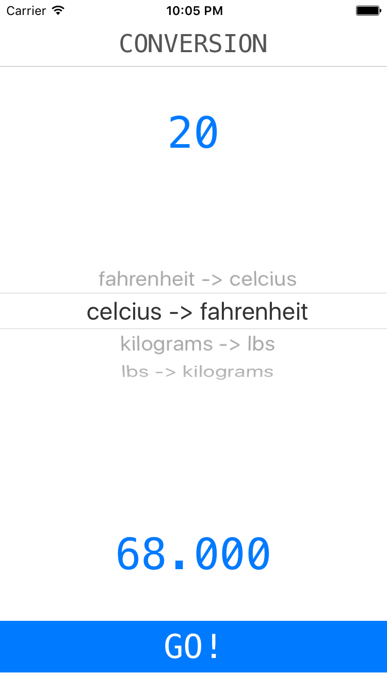
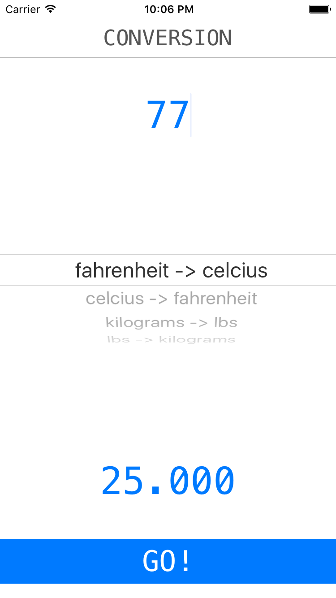

#  IB Outlets Lab

## Introduction

#### What we are doing

In this lab, we will practice using Interface Builder to create Outlets and Actions.

> ***Note:*** _This Lab should be done independently._

#### Why we are doing it

IBOutlets and IBActions are what allows you to connect the user interface to your code. Without them, your apps would never be able to respond to the user, or do anything interesting.

Worse still, without Interface Builder, you would have to write your User Interface with code alone. Who wants to do that?

## Exercise

### Requirements

Write a Unit Conversion App that allows the user to convert between different units.

+ The user should be able to enter a number.
+ The user should be able to select a unit conversation, for example, "Fahrenheit to Celsius", "Kilograms to Pound", etc.
+ The user should be able to tap a button to trigger the conversion.

+ The following conversions are required:
    + Fahrenheit to Celsius
    + Celsius to Fahrenheit
    + Kilograms to Pounds
    + Pounds to Kilograms

### Starter code
There is no starter code.

### Solution Code
Solution code can be found in [solution-code](solution-code).

## Deliverables

The final Deliverable should be a Single View Application that meets the requirements above.

It should look something like this:

</img>

</img>

### Bonus Activities

+ Have the conversion result triggered whenever the user changes the units.

Add the following conversions:

+ Feet to Miles
+ Miles to Feet
+ Kilometers to Miles
+ Miles to Kilometers
+ Kilowatt Hours to Kilocalories
+ Kilocalories to Kilowatt Hours
+ Gigabytes to Bytes
+ Terabytes to Kilobytes
+ Gigabytes to Bits
+ Hour to Seconds
+ Week to Minutes
+ Week to Hours

# Additional Resources

+ [Official Apple Developer Website](https://developer.apple.com/library/ios/navigation/)
+ [Interface Builder](https://developer.apple.com/xcode/interface-builder/)
