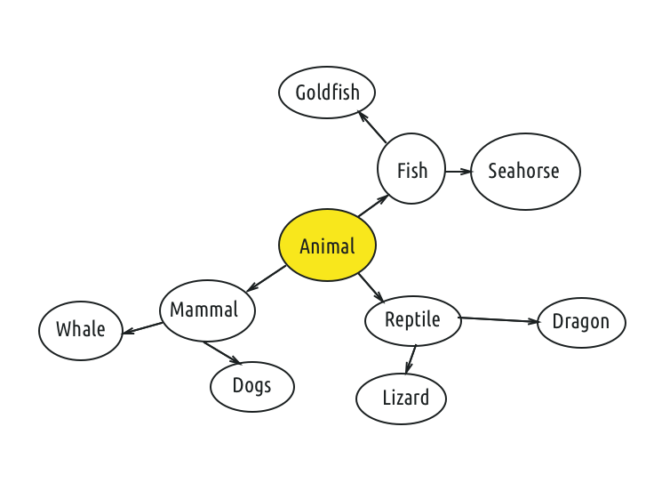

#  Inheritance Lab

## Introduction

#### What we are doing

In this lab, we will practice using Inheritance to create classes and sub-classes.

> ***Note:*** _This lab should can be done collaboratively or independently._

#### Why we are doing it

Inheritance is one of the three basic Object-Oriented Programming Principles and allows for Polymorphism. Polymorphism allows you to declare: a Dragon is a Reptile; or an Integer is a Number.

In the same way that functions allow you to capture a piece of code and then re-use that code, Inheritance allows a class to acquire properties and functionality from another class - its "parent" class.

Inheritance is used extensively in the iOS SDK. For example, a UIButton extends a UIView - that means a Button is a View.  All the drawing and graphics code in the UIView class is *inherited* by the UIButton class, and does not need to be rewritten for the UIButton class.

## Exercise

In this exercise, we are going to model a basic animal kingdom. The objective is to create a family tree, starting from Animal. Each class will have properties and functions that are specific to that species.

For example, implementing a `makeNoise()` method for a Dog would print "Woof!", but for a Bird it might print "Chirp."

### Requirements

**Classes**

Model the Animal Kingdom with Swift Classes by using Inheritance.

In your base Animal class, include the following:

+ A function `makeNoise()`. Each sub-class is expected to provide its own implementation. Thus, a dog's `makeNoise()` method would bark.

+ A function `move()`, where each sub-class prints how the animal moves. For example, does it walk, crawl, fly, etc?

+ A function `canMateWith(other: Animal) -> Bool` that checks whether an animal can mate with another, following the rule that an animal can only mate with members of its own species. Make sure each sub-class provides its own implementation.

**Functions**

+ Write a function that checks whether two animals are in the same family. For example, a Seahorse and a Goldfish are both Fish (just roll with it).

### Starter code
There is no starter code.

### Solution Code
Solution code can be found in [solution-code](solution-code).

## Deliverables

Turn in your code in a single Playgrounds Project.

**Verify that**
+ Your code compiles
+ You created instances of each of your Classes
+ You tested the Objects by calling their functions and accessing their data

---

### Bonus Activities

+ Write a function that takes an Array of Animals and calls their `makeNoise()` and `move()` methods.

+ Write a function takes an Array of Animals and returns the total number of Reptiles.
    + Another returning the total number of Fish.

+ Add an image for each animal using a `UIImageView`.

---

# Additional Resources

+ [Swift Reference](https://developer.apple.com/library/ios/documentation/Swift/Conceptual/Swift_Programming_Language/GuidedTour.html#//apple_ref/doc/uid/TP40014097-CH2-ID1)
+ [Inheritance in Swift](https://developer.apple.com/library/ios/documentation/Swift/Conceptual/Swift_Programming_Language/Inheritance.html)
+ [Swift Classes](https://developer.apple.com/library/ios/documentation/Swift/Conceptual/Swift_Programming_Language/ClassesAndStructures.html)
