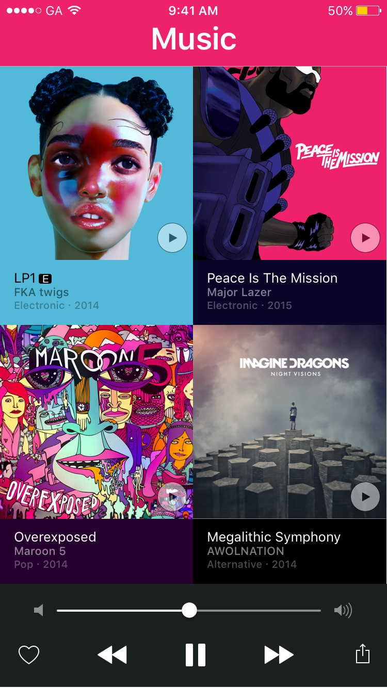
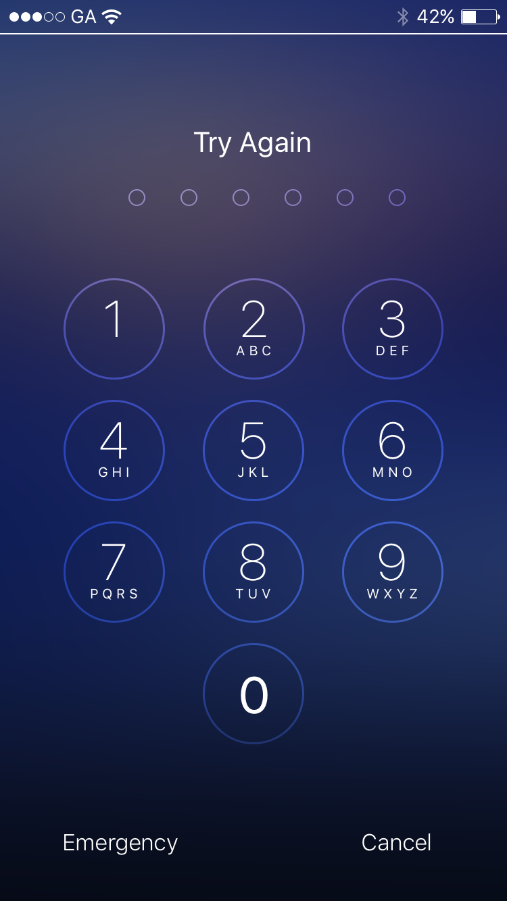

#  Autolayouts Lab

## Introduction

#### What we are doing

In this lab, we will practice using Autolayouts to create responsive UI's in iOS.

> ***Note:*** _This lab should be done independently._

#### Why we are doing it

Autolayouts allow a developer to describe how UI Elements should behave and look with respect to screen size.

Without Autolayouts, you would have to write code to manually position elements for all different iPhones and iPads.

## Exercise

We will practice Autolayouts by taking Mockups of User Interfaces and re-creating them in Storyboards. Ensure that every element in view is positioned and sized correctly.

### Requirements

The User Interfaces are located in the [deliverables](deliverables) folder.

+ Translate at least 1 View in folder.

###### Screen 1
 

###### Screen 2
 

###### Screen 3

 See [here](http://www.appcoda.com/ios-programming-circular-image-calayer/) for how to create circular views.

###### Screen 4
 

> Note: Approximation is ok, within reason. Use your own images and themes. For the purpose of this lab, the layout is more important than the content.

Look in the [deliverables](deliverables) folder to see a picture of each view.

**Verify that:**

+ All app elements are positioned correctly.
+ You tested the app on multiple iPhones [5s, 6, 6+], and it works correctly.

> Note: Swift code should not be necessary for this lab, but you might need it to create transitions between screens, on a click, for example.

### Starter code
There is no starter code for this lab.

### Solution Code

There is no solution code for this lab.

---

## Deliverables

Turn in your assignment via an XCode project that contains the View.

If you do more than one screen, use a `UITableViewController` to link to each one.

### Bonus Activities

+ Re-create a second View

+ Re-create all the Views

# Additional Resources

+ [Official Apple Developer Website](https://developer.apple.com/library/ios/navigation/)
+ [Interface Builder](https://developer.apple.com/xcode/interface-builder/)
+ [Autolayouts Guide](https://developer.apple.com/library/ios/documentation/UserExperience/Conceptual/AutolayoutPG/)
