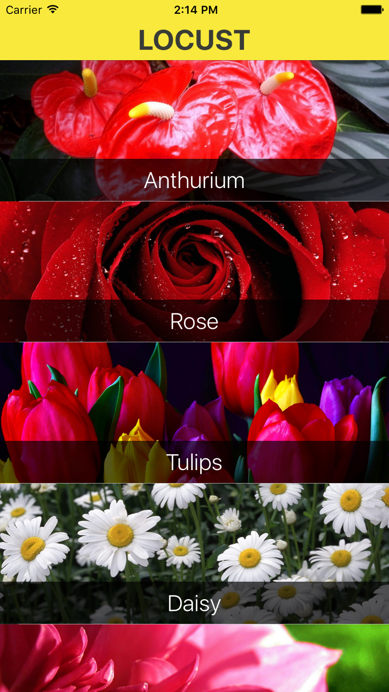
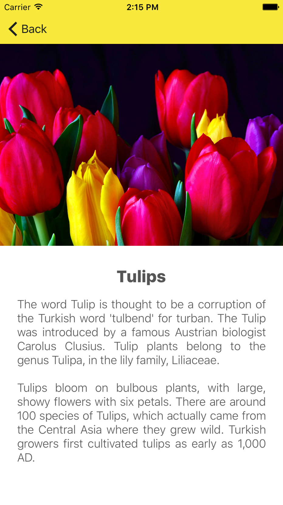

#  Debugging Lab

## Introduction

#### What we are doing

In this lab, we will practice using the XCode Debugger to fix bugs.

> ***Note:*** _This lab can be done collaboratively or independently._

#### Why we are doing it

Debugging allows you to detect and fix bugs within your apps. One can pause execution, analyze the application state,and execute code line-by-line. Use it to make sure your code is working as expected. It is an essential tool in a Software Engineer's Toolbox.

## Exercise

Open the project in [starter-code](starter-code) and fix the app until it doesn't crash.

### Requirements

### Starter code

Starter code can be found in the [stater-code](starter-code) folder.

### Solution Code
Solution code can be found in the [solution-code](solution-code) folder.

## Deliverables

Turn in a working XCode with all of the Bugs fixed.

The App should look like this:

**Verify that**
+ The code compiles
+ The App does not crash

---

### Bonus Activities

+ Improve the App by adding at least 3 additional flowers.

---

# Additional Resources

+ [Debugging Tutorial](https://developer.apple.com/videos/play/wwdc2014/413/)
