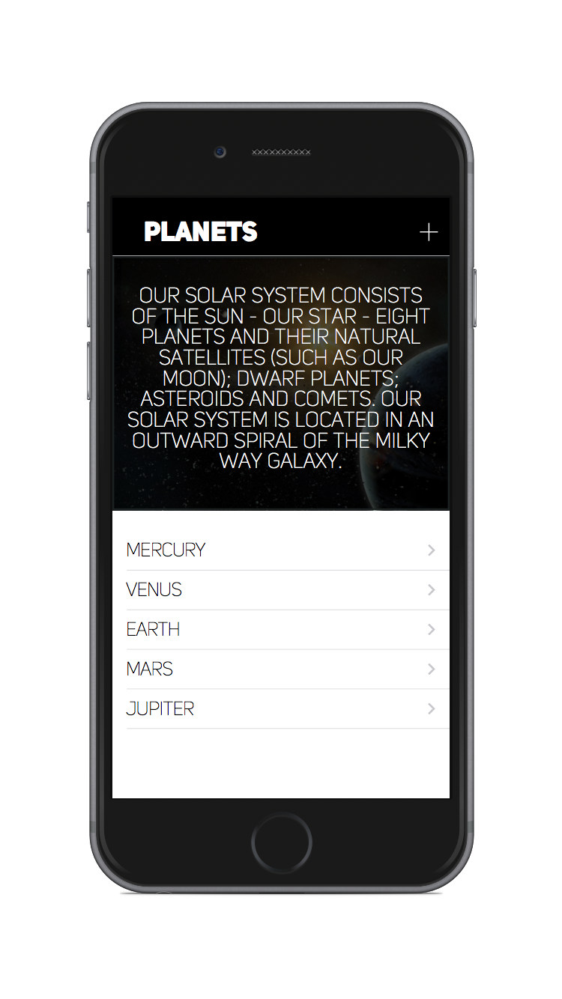
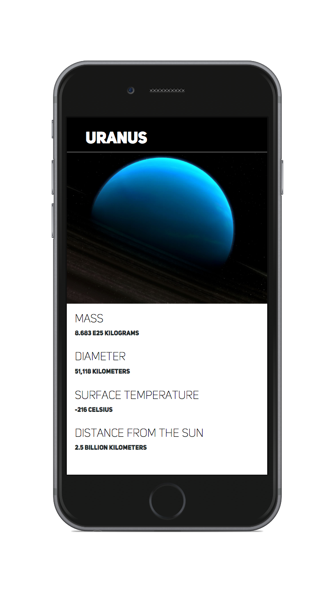

#  Passing Data Lab

## Introduction

#### What we are doing

In this lab, we will practice using `prepareForSegue()` to pass data between views.

> ***Note:*** _This lab can be done independently or in pairs._

#### Why we are doing it

Imagine you were creating an App that showcased every major city on planet Earth. Without the ability to pass data using `prepareForSegue()`,
you would need to create a separate UIViewController for each city, and a segue for each one.

Passing Data allows you to cleanly separate *what* you are showing from *how* you are showing it.

## Exercise

Create an App that shows a list of each planet in our Solar System and gives information about each one. (Pluto is optional)

### Requirements

+ Create a "Planet List" Table View Controller that shows the name of each planet.

+ Create a "Planet Info" View Controller that shows the following information about a planet:
    + Name
    + Photo
    + Mass
    + Diameter
    + Surface temperature
    + Distance from the Sun

+ When the user clicks on a planet from the Planet List, show the corresponding Planet Info view.

### Starter code

Starter code is optional, and can be found in the [starter-code](starter-code) folder.

### Solution Code
Solution code can be found in the [solution-code](solution-code) folder.

## Deliverables

Turn in your XCode Project.

It should look like this:

**Verify that**
+ Your App never crashes
+ Your code compiles
+ The Planets are displayed correctly
+ A planet's info is shown when the name of a planet is tapped.

### Bonus Activities

+ Give users the ability to add their own planets.
> Tip: Use the [UIAlertController](https://developer.apple.com/library/ios/documentation/UIKit/Reference/UIAlertController_class/) to
create a text popup.

+ Add a swipe-to-delete feature that allows users to delete Planets from the List.

+ Update the swipe-to-delete feature to prevent deletion of any of the real 8 planets.

+ Adhere to the Style Guide:

# Additional Resources

+ [Swift Reference](https://developer.apple.com/library/ios/documentation/Swift/Conceptual/Swift_Programming_Language/GuidedTour.html#//apple_ref/doc/uid/TP40014097-CH2-ID1)
+ [UITableViewController Reference](https://developer.apple.com/library/ios/documentation/UIKit/Reference/UITableViewController_Class/)
+ [UIAlertController](https://developer.apple.com/library/ios/documentation/UIKit/Reference/UIAlertController_class/)

**Planet Info**
+ http://space-facts.com/mercury/
+ http://nineplanets.org/
