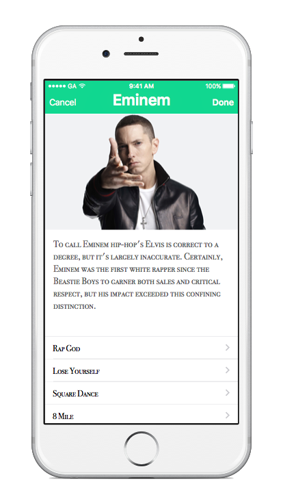

#  Table View Lab

## Introduction

#### What we are doing

In this lab, we will practice using Table Views to create dynamic and scrollable applications.

> ***Note:*** _This Lab can be done independently or in pairs._

#### Why we are doing it

With its famous bounce effect, the Table View is one of the most iconic UI Elements used in iOS. You see it on your Twitter feed, the Settings App, the Notes app, and nearly every other dynamic app. They allow you to display an arbitrary amount of content. You will most certainly need them in your class projects and in real world apps.

## Exercise

Create an App that showcases your favorite artist, by listing his/her top tracks.

### Requirements

Each table cell should include the following:

+ Name of Song (as the cell Title)
+ Album Name (as the cell Subtitle)
+ Add a Profile picture and a bio of your Artist at the top, using the Header View.

### Starter code
There is no starter code for this project.

### Solution Code
Solution code can be found in the [solution-code](solution-code) folder.

## Deliverables

Turn in your XCode Project.

Your App should look something like this:

**Verify that**
+ Your App does not crash
+ Your code compiles
+ Your tracks display correctly
+ Your code runs correctly and produces the correct result

### Bonus Activities

+ Include the album cover art for each cell (as the cell Image)

+ Make it so that when the user taps on a song, it takes you to the corresponding YouTube video, Spotify link, or other. See [here](http://stackoverflow.com/a/28501688) for how to open URLs in Safari.

+ Use the [Sections](https://developer.apple.com/library/ios/documentation/UIKit/Reference/UITableViewDataSource_Protocol/index.html#//apple_ref/occ/intfm/UITableViewDataSource/numberOfSectionsInTableView:) feature to add at least 3 Albums, with each section titled after album.

+ Add the ability to delete a Song from the List.

+ Adhere to the Style Guide.

# Additional Resources

+ [Official Apple Developer Website](https://developer.apple.com/library/ios/navigation/)
+ [Swift Control Flow](https://developer.apple.com/library/ios/documentation/Swift/Conceptual/Swift_Programming_Language/ControlFlow.html#//apple_ref/doc/uid/TP40014097-CH9-ID120)
+ [Adding Sections to a Table View](http://www.appcoda.com/ios-programming-index-list-uitableview/)
