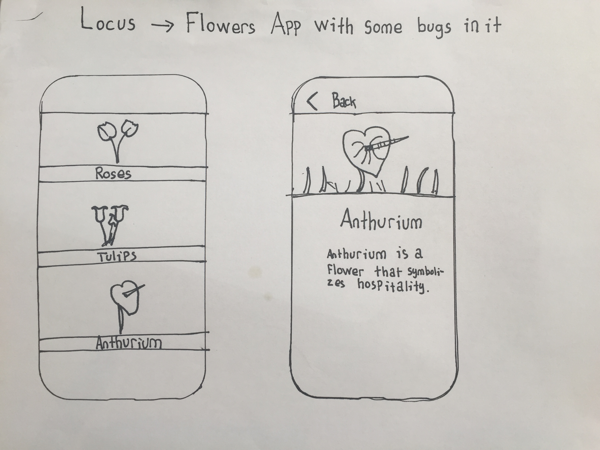
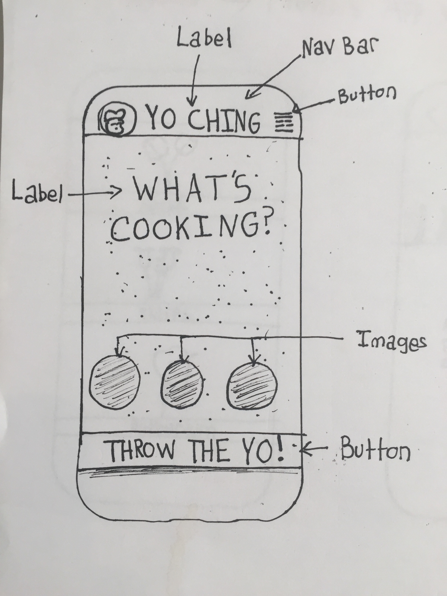

#  App UI Analysis Lab

## Introduction

#### What we are doing

In this lab, we will practice critical thinking skills to break down interfaces into parts and use wireframes to create "lo-fi" prototypes.

> ***Note:*** _This lab should be done collaboratively._

#### Why we are doing it

Being an iOS Developer means working with Designers. Designers don't think in terms of `UIKit`, nor in Swift. Therefore, it is up to you to translate visual designs and determine what components are involved *before* you begin writing code.

## Exercise

In this lab, a wireframe can be a paper mock-up or experiment with Interface Builder to see what elements are available.

### Requirements

###### Part 1: Create (60 mins)

Pick a popular App that you like to use and do the following:

+ Analyze 3 of the views, and take note of what components are what on a sheet of paper.

+ Make a wireframe of each view. You can use pen and paper for this, or digital paper.

+ Discuss the positioning of each element. You can say things like, "Centered Horizontally", "30 points from the Top", etc.

+ Discuss the sizing of each element. You can say things like, "40 points wide", "1/3 the device height", "Same height as...", "etc".

###### Part 2: Present (25 mins)

Each student will get 1 minute to present their work to the class.

### Starter code
There is no starter code.

### Solution Code
There is no solution code for this lab.

## Deliverables

For part one, here are some sample paper mock-ups:

For part two, present your findings in front of the class, via a presentation.

+ Show a screenshot of the original View.
+ Discuss your thought process and how you broke down the UI.
+ Discuss how you positioned the elements.
+ Discuss how you sized the elements.
+ Show wireframes to communicate your approach to developing the UI.

Any presentation software will do: Keynote, Power Point, or Google Slides.
Focus on the overall message and not so much the style.

Finally, send a pull request to this repository with pictures of what you came up with for part one and a link or file for part two in a readme.

---

### Bonus Activities

+ Take your wireframes and create semi-accurate representations of them using Interface Builder.

+ Come up with what you think would be a better User Interface, and be prepared to justify your design choices.

---

# Additional Resources

+ [Apple's Human Interface Guidelines](https://developer.apple.com/ios/human-interface-guidelines/)
+ [Swift Reference](https://developer.apple.com/library/ios/documentation/Swift/Conceptual/Swift_Programming_Language/GuidedTour.html#//apple_ref/doc/uid/TP40014097-CH2-ID1)
