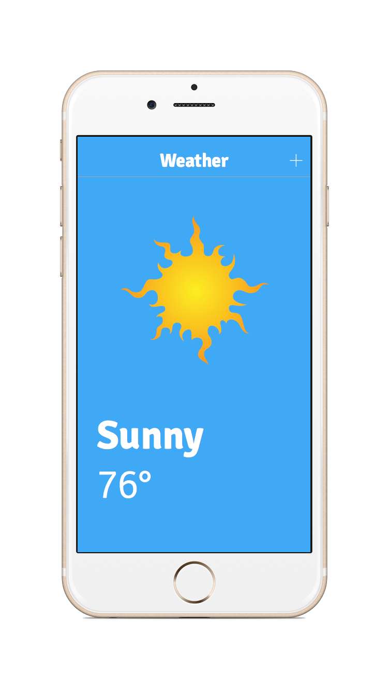

#  Intermediate Swift Lab

## Introduction

#### What we are doing

In this lab, we will practice using more advanced Swift programming features.

> ***Note:*** _This lab should be done independently._

#### Why we are doing it

The topics you practice here will help you make further progress you on your journey to achieving Swift mastery.
As projects become larger, these swift features help keep the code simple and easy to understand.

## Exercise

In this exercise we will cover:
+ Enums
+ Singletons
+ Delegates
+ Protocols

### Requirements

Build a single-page app for displaying the weather.

+ When the app opens, the temperature is 0℉. Each time the weather is checked, it goes up by 1°, until it reaches 100℉.
+ When it reaches 100℉, the temperature starts going down by 1°, until it reaches 0℉ again.
+ Repeat this cycle as long as the App is open.

For the code, adhere to the following:

+ A `WeatherCondition` enum with the following values: `[Sunny, Cloudy, Rainy, Snowy, Windy]`.

+ A `WeatherStatus` class that captures what the current weather is like.
    + This class should have a `temperature: Double` property.
    + This class should have a `conditions: WeatherCondition` property saying what the weather conditions are like.

+ A `WeatherService` class with a Singleton instance. This service should provide the ability to `getCurrentWeather() -> WeatherStatus`.

+ A `WeatherDelegate` protocol with the method `weatherDidUpdate(WeatherStatus)`.

+ Use an [Timer](http://stackoverflow.com/questions/24007518/how-can-i-use-nstimer-in-swift) to check for the weather and update the view every `5.0` seconds.

> Note: The Weather Conditions can be generated at random, or at a fixed-rated.

### Starter code

There is no starter code for this Lab.

### Solution Code
Solution code can be found in the [solution-code](solution-code) folder.

## Deliverables

Turn in your Xcode Project by submitting a PR.

It should look something like this:

 </img>

**Verify that**

+ Your code compiles.
+ Your App never crashes.
+ You adhered to the Code and Functional requirements.
+ The weather updates.

### Bonus Activities

+ Design the code such that the `WeatherService` updates itself every 5 seconds, and calls the `delegate` with any updates.

+ Use the [Open Weather API](http://openweathermap.org/api) to add real weather data.

# Additional Resources

+ [Swift Reference](https://developer.apple.com/library/ios/documentation/Swift/Conceptual/Swift_Programming_Language/GuidedTour.html#//apple_ref/doc/uid/TP40014097-CH2-ID1)
+ [UITableViewController Reference](https://developer.apple.com/library/ios/documentation/UIKit/Reference/UITableViewController_Class/)
+ [URL Encoding](https://developer.apple.com/library/ios/documentation/Cocoa/Reference/Foundation/Classes/NSString_Class/index.html#//apple_ref/occ/instm/NSString/stringByAddingPercentEncodingWithAllowedCharacters:)
