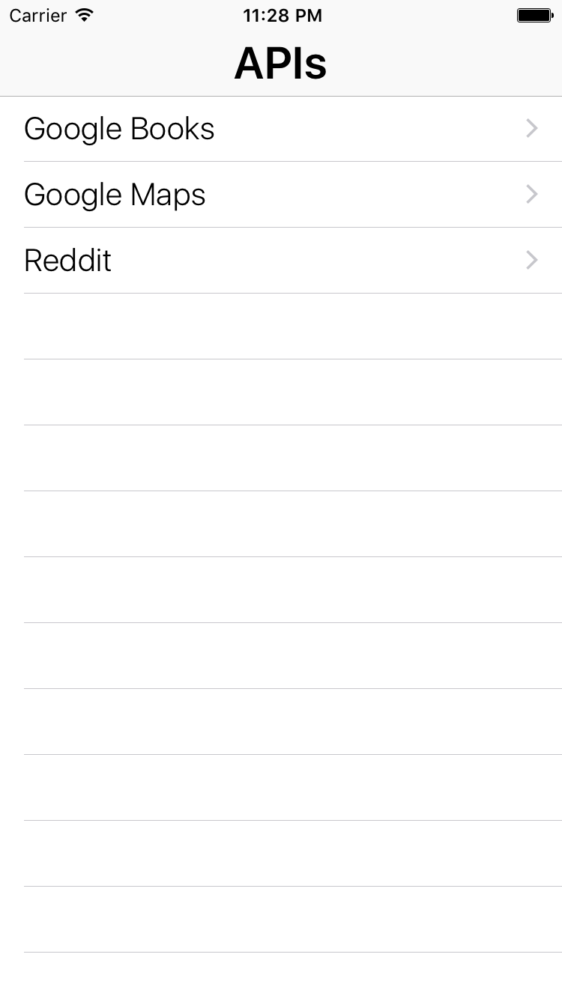
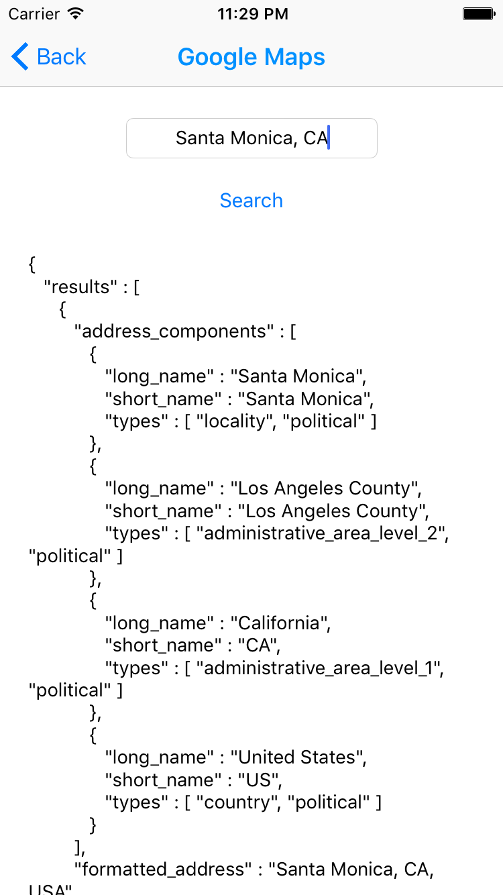

#  iOS Networking Lab

## Introduction

#### What we are doing

In this lab, we will practice connecting to the web and getting information.

> ***Note:*** _This lab should be done independently._


#### Why we are doing it

We are doing this for the same reason why you run to the grocery store when you need food: you can't have everything locally.

When you go to your Gmail account, your web-browser fetches your mail from the Internet. Without it, Gmail would be a terribly boring service.

Being able to connect your apps to the Internet and make requests allows
you to do things like:

+ Get the weather
+ Get the latest news
+ Find out a person's Facebook friends
+ Sign into an account
+ Buy something.

The list goes on and on.

## Exercise

Use `NSURLSession` to make web calls to various Web APIs and display the results in a `UITextView`.

### Requirements

+ The project should be an App with an initial `UITableViewController`, with an element for each of the following APIs.

    + Reddit: https://www.reddit.com/.json
    + Google Maps: https://maps.googleapis.com/maps/api/geocode/json?address=Oxford%20University,%20uk&sensor=false
    > NOTE: Use [URL Encoding](https://developer.apple.com/library/ios/documentation/Cocoa/Reference/Foundation/Classes/NSString_Class/index.html#//apple_ref/occ/instm/NSString/stringByAddingPercentEncodingWithAllowedCharacters:) to encode plain text.

    + Open Notify API: http://api.open-notify.org/iss-now.json
    This API shows the [current location of the International Space Station](http://open-notify.org/Open-Notify-API/ISS-Location-Now/).

    > NOTE: Try opening these APIs directly in your web-browser.

---

+ For each API, design a View that shows the result of the Web Call.

> For Example, calling "https://maps.googleapis.com/maps/api/geocode/json?address=Oxford%20University,%20uk&sensor=false"
gives me:

    ```json
    {
       "results" : [
          {
             "address_components" : [
                {
                   "long_name" : "Oxford University",
                   "short_name" : "Oxford University",
                   "types" : [ "premise" ]
                },
                {
                   "long_name" : "3",
                   "short_name" : "3",
                   "types" : [ "street_number" ]
                },
                {
                   "long_name" : "Church Walk",
                   "short_name" : "Church Walk",
                   "types" : [ "route" ]
                },
                {
                   "long_name" : "Oxford",
                   "short_name" : "Oxford",
                   "types" : [ "locality", "political" ]
                },
                {
                   "long_name" : "Oxford",
                   "short_name" : "Oxford",
                   "types" : [ "postal_town" ]
                },
                {
                   "long_name" : "Oxfordshire",
                   "short_name" : "Oxfordshire",
                   "types" : [ "administrative_area_level_2", "political" ]
                },
                {
                   "long_name" : "England",
                   "short_name" : "England",
                   "types" : [ "administrative_area_level_1", "political" ]
                },
                {
                   "long_name" : "United Kingdom",
                   "short_name" : "GB",
                   "types" : [ "country", "political" ]
                },
                {
                   "long_name" : "OX2 6LY",
                   "short_name" : "OX2 6LY",
                   "types" : [ "postal_code" ]
                }
             ],
             "formatted_address" : "Oxford University, 3 Church Walk, Oxford OX2 6LY, UK",
             "geometry" : {
                "location" : {
                   "lat" : 51.7641155,
                   "lng" : -1.2632365
                },
                "location_type" : "ROOFTOP",
                "viewport" : {
                   "northeast" : {
                      "lat" : 51.76546448029149,
                      "lng" : -1.261887519708498
                   },
                   "southwest" : {
                      "lat" : 51.76276651970849,
                      "lng" : -1.264585480291502
                   }
                }
             },
             "place_id" : "ChIJm5HGSRzEdkgRq0j9omrsN5s",
             "types" : [ "premise" ]
          }
       ],
       "status" : "OK"
    }
    ```

---

### Starter code

There is no starter code for this Lab.


### Solution Code
Solution code can be found in [./solution-code](solution-code).

## Deliverables

Turn in your XCode Project by submitting a PR.

It should look something like this:






**Verify that**

+ Your code compiles.
+ Your App never crashes.
+ The results of the Web call are shown on a `UITextView` or `UILabel` (if it can fit there).
+ You are using the Main Queue to update UI Elements.
+ You are using Autolayouts in your Storyboards.

### Bonus Activities

+ Update the Google Maps View to allow the user to enter an address. Use this address in the web call.

+ Add another API, [Google Books API](https://www.googleapis.com/books/v1/volumes?q=isbn:0747532699).
    + Add the ability for the user to enter an ISBN and get back book information.


+ For each View use the [Network Indicator](http://stackoverflow.com/questions/10299889/how-to-turn-on-the-network-indicator-in-the-ios-status-bar) to indicate when the request begins, and turn it off when the request is over.
> A Network indicator is that spinner that appears at the top of the status bar to indicate an ongoing activity.

# Additional Resources

+ [Swift Reference](https://developer.apple.com/library/ios/documentation/Swift/Conceptual/Swift_Programming_Language/GuidedTour.html#//apple_ref/doc/uid/TP40014097-CH2-ID1)
+ [UITableViewController Reference](https://developer.apple.com/library/ios/documentation/UIKit/Reference/UITableViewController_Class/)
+ [URL Encoding](https://developer.apple.com/library/ios/documentation/Cocoa/Reference/Foundation/Classes/NSString_Class/index.html#//apple_ref/occ/instm/NSString/stringByAddingPercentEncodingWithAllowedCharacters:)
