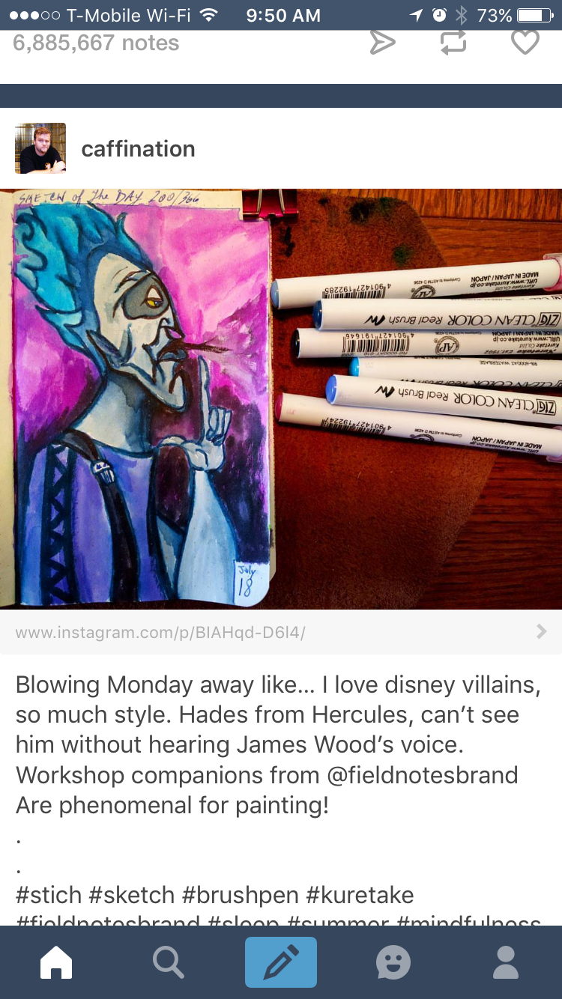
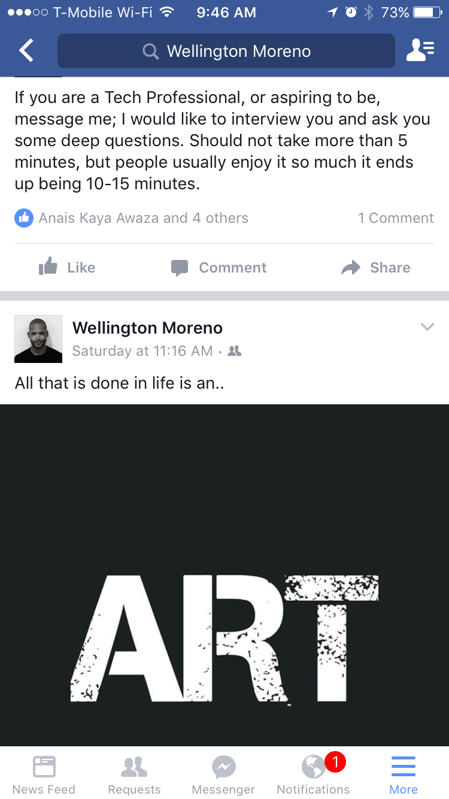
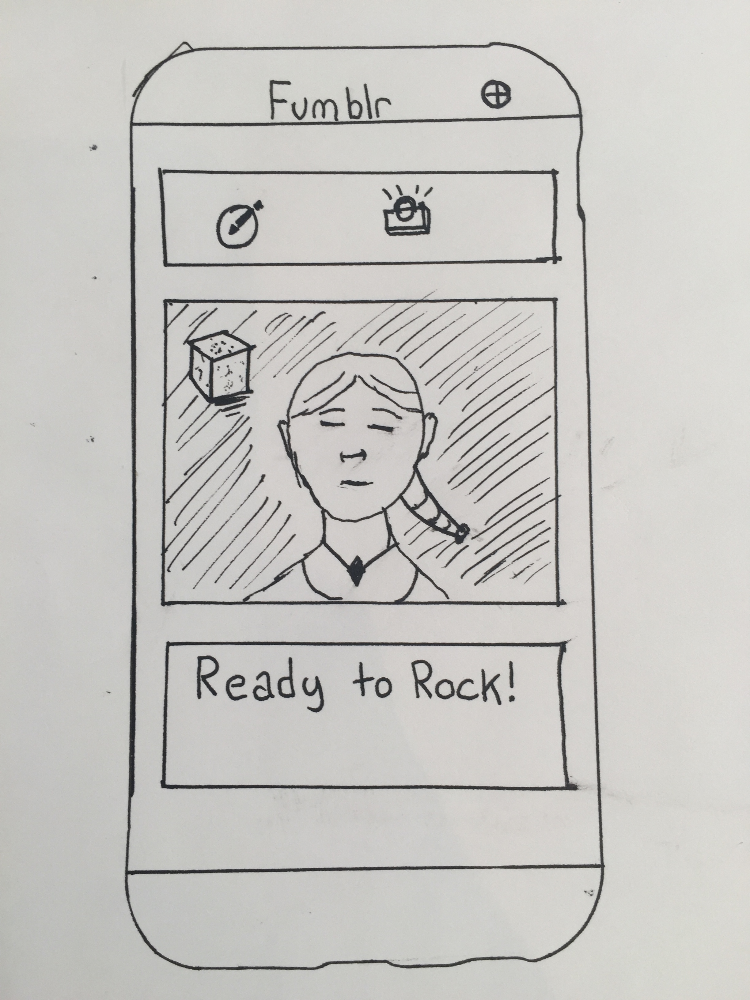
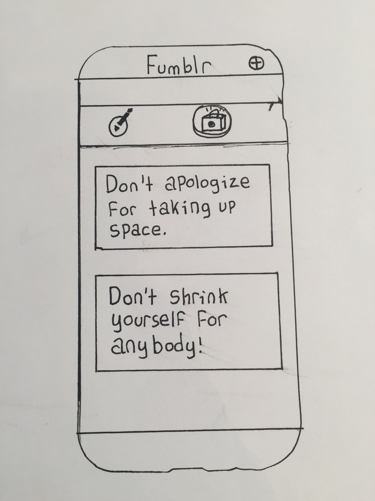
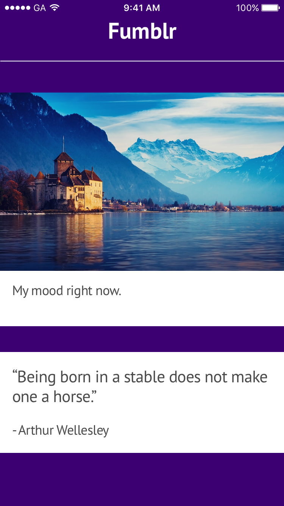
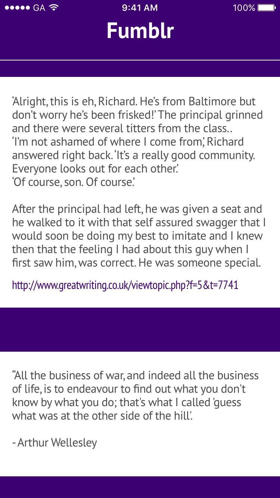
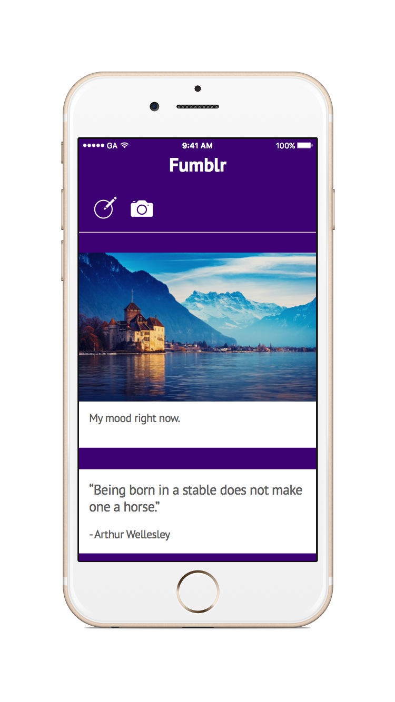
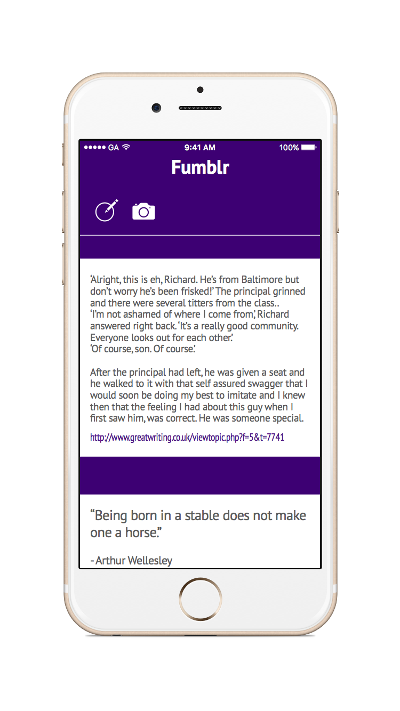
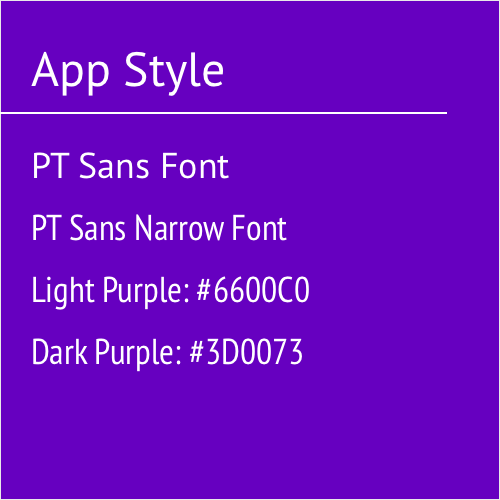

#  Custom Table Views Lab

## Introduction

#### What we are doing

In this lab, we will practice creating custom Table View Cells to create unique Apps.

> ***Note:*** _This lab can be done independently or in pairs._

#### Why we are doing it

Let's face it; the plain Table View looks boring. It doesn't have much style or functionality.
Using custom table views allows you to create apps that look like this:

**Tumblr**

 </img>

---

**Facebook**

 </img>

## Exercise

In this lab, we will create an App that looks like a Facebook/Tumblr clone. It will contain a Table View
that uses Custom Cells allow for Image Posts and Text Posts.

**Fumblr**

 </img>

Here are some low-fidelity sketches of the Fumblr interface:

**Low-Fi 1**

 </img>

**Low-Fi 2**

 </img>

---

**Hi-Fi 1**

 </img>

**Hi-Fi 2**

 </img>

---

### Requirements

+ The app should have at least 40 posts.
    + The posts should vary between image and text posts. They can be any images or any text.

+ Use two custom table cells, one for an image post, and another for a regular text post.

+ The image post can have both an image and a caption.

+ The text post can only have a text post.

+ Use Autolayouts in your custom cells to lay things out.

+ Add a visual "gap" between the posts so that there they aren't directly on top of each other.

> Feel free to use your own images, captions, and text posts. Grab some from tumblr.

### Starter code

There is no started code.

### Solution Code
Solution code can be found in [solution-code](solution-code).

## Deliverables

Turn in your Xcode Project.

It should look like this:

> Style Guide:

> </img>

---

**Verify that**

+ Your App never crashes
+ Your code compiles
+ You used at least 2 custom Table View Cells

### Bonus Activities

+ Make each cell look more card like
+ Add 2 table view cellrow actions
	+ The row actions should be different for each cell 
+ Make each cell clickable, so that when the user taps on a post, it takes you to a new View Controller with that post.
+ Create the interface so that it adapts to the iPad.
+ Give the user the ability to post their own texts and photos

# Additional Resources

+ [Swift Reference](https://developer.apple.com/library/ios/documentation/Swift/Conceptual/Swift_Programming_Language/GuidedTour.html#//apple_ref/doc/uid/TP40014097-CH2-ID1)
+ [UITableViewController Reference](https://developer.apple.com/library/ios/documentation/UIKit/Reference/UITableViewController_Class/)
