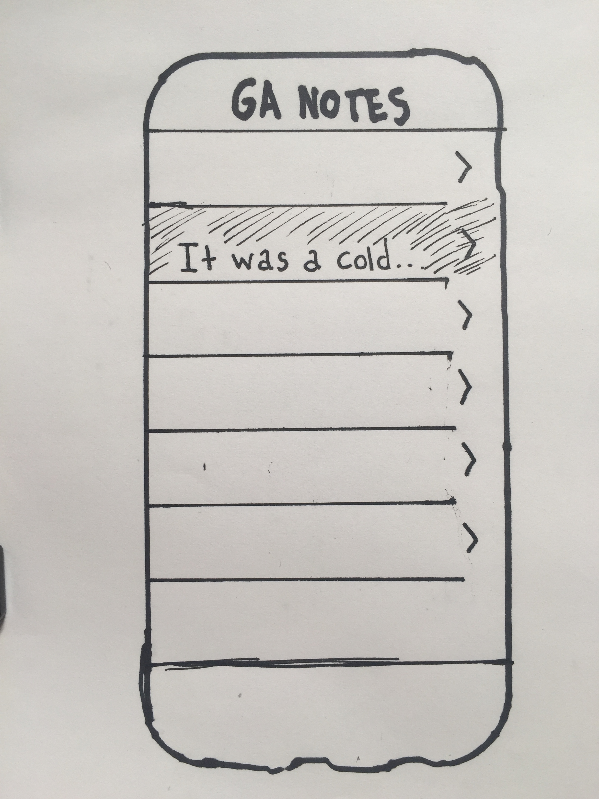
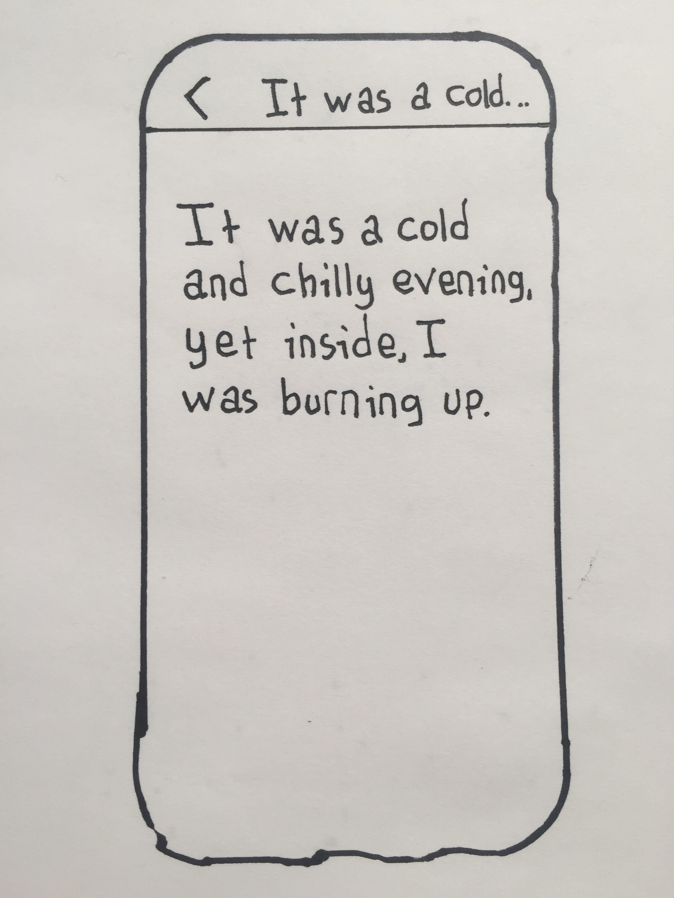
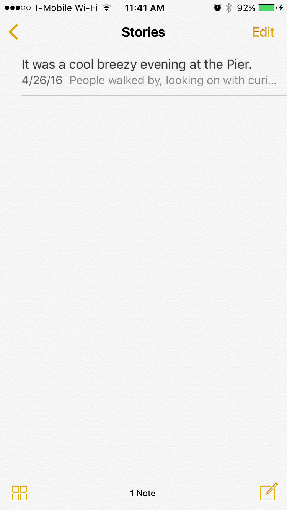
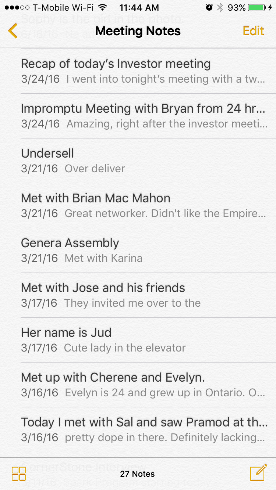
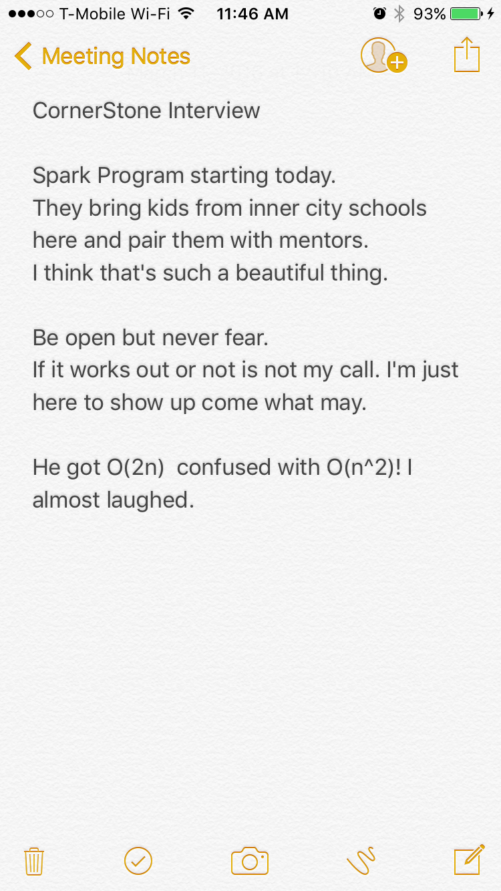
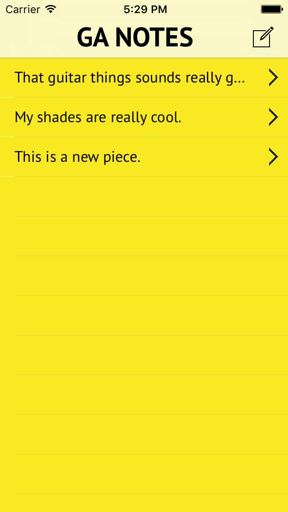

#  Data Persistence Lab

## Introduction

#### What we are doing

In this lab, we will practice data persistence to create apps that remember things after they are restarted.

> ***Note:*** _This lab can be done independently or in pairs._

#### Why we are doing it

Imagine if you woke up every day, and didn't remember your name or who you were.  Apps that don't remember things are like that; every time you launch them, it's like the first time.

Data Persistence allows your users to come into an app that remembers them, making the experience more personal.

## Exercise

In this lab, we will recreate the stock Notes App.

Here are some low-fidelity sketches of the interface:

**Low-Fi 1**

 </img>

**Low-Fi 2**

 </img>

---

Here are some screenshots from the Apple Notes App.

**Hi-Fi 1**

 </img>

**Hi-Fi 2**

 </img>

**Hi-Fi 3**

 </img>

**Notes:**
+ Don't worry about the toolbar in the bottom.
+ You can have the "Edit" button on the topx

---

### Requirements

Users should be able to:

+ Have the app save all of their notes
    + All edits made should autosave

+ Add new notes

+ Delete their notes

### Starter code

Starter code can be found in [starter-code](starter-code).

### Solution Code
Solution code can be found in [./solution-code](solution-code).

## Deliverables

Turn in your XCode Project.

It should look something like this:

 </img>

**Verify that**
+ Your App never crashes
+ Your code compiles
+ When you quit the app and restart, all the notes are still there.

### Bonus Activities

+ Write Unit Tests for the data persistence code.

+ Style it up, and make it your own.

+ Use the `UITextView.becomesFirstResponder()` method to make the keyboard automatically pop up when a new note is opened.
    + The keyboard should not pop up when an existing note was opened.

+ Record the time last edited, and display it with each note.
    For example, *Last Edited: July 12th 8:39 pm*

# Additional Resources

+ [Swift Reference](https://developer.apple.com/library/ios/documentation/Swift/Conceptual/Swift_Programming_Language/GuidedTour.html#//apple_ref/doc/uid/TP40014097-CH2-ID1)
+ [UITableViewController Reference](https://developer.apple.com/library/ios/documentation/UIKit/Reference/UITableViewController_Class/)
+ [NSUserDefaults](https://developer.apple.com/library/mac/documentation/Cocoa/Reference/Foundation/Classes/NSUserDefaults_Class/)

+ [Serializing a Swift Object](http://stackoverflow.com/questions/25382013/get-does-not-implement-methodsignatureforselector-when-try-to-store-array-in-n)

+ [NSKeyedArchiver](http://mhorga.org/2015/08/25/ios-persistence-with-nscoder-and-nskeyedarchiver.html)
