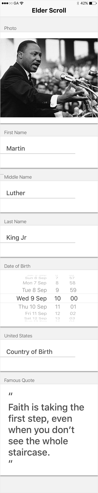
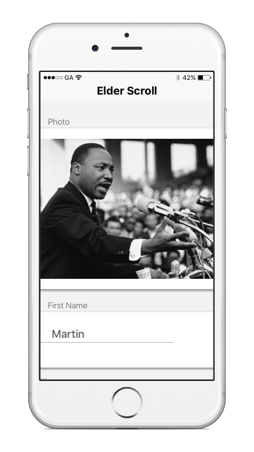
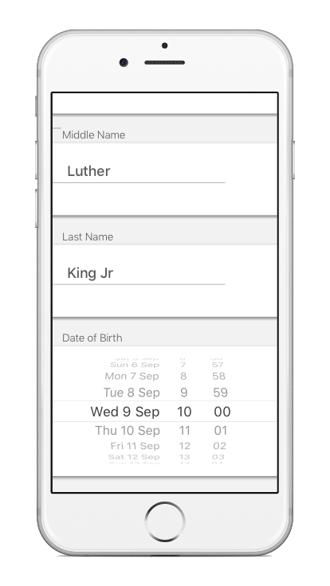
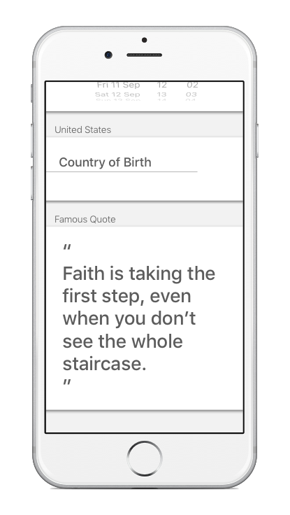

#  Scrollviews Lab

## Introduction

#### What we are doing

In this lab, we will practice using Scrollviews to create flexible scrollable User Interfaces.

> ***Note:*** _This lab should be done independently._

#### Why we are doing it

There will be times when UI Elements do not fit on the screen all at once.
Scrollviews allow you to add that buttons, labels, and images you want, with a simple scrollable interface.

## Exercise

Pick a famous historical person and create a Single View App with a profile for them.

### Requirements

Create a Single-View App that contains information about the person.
> Forms are a common use-case for ScrollViews. The other is for Pinch-To-Zoom images.

The profile page has the following information about the person:

+ Photo
+ First Name
+ Middle Name
+ Last Name
+ Date of Birth
+ Country of Birth
+ Famous Quote

**Verify that:**

+ All app elements are positioned correctly.
+ The screen is scrollable.
+ You tested the app on multiple iPhones [5s, 6, 6+], and it works correctly.
+ You can scroll all the way through all of the fields and labels.

> NOTE: Swift code is not necessary for completion of this Lab. No behavior is expected.

### Starter code

There is no starter code for this lab.

### Solution Code

There is no solution code provided for this lab.

---

## Deliverables

Turn in your assignment via an XCode project.

Your view should look like this:

**Full View**

</img>

**Partial View 1**

</img>

**Partial View 2**

</img>

**Partial View 3**

</img>

---

### Bonus Activities

+ Make the name fields editable.

+ Make the quote field editable.

+ Do a second person's profile.

# Additional Resources

+ [Official Apple Developer Website](https://developer.apple.com/library/ios/navigation/)
+ [Interface Builder](https://developer.apple.com/xcode/interface-builder/)
+ [Autolayouts Guide](https://developer.apple.com/library/ios/documentation/UserExperience/Conceptual/AutolayoutPG/)
+ [Scrollview with Autolayouts](https://spin.atomicobject.com/2014/03/05/uiscrollview-autolayout-ios/)
