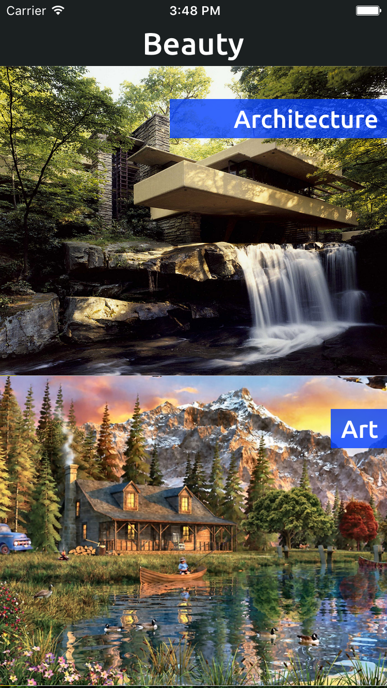
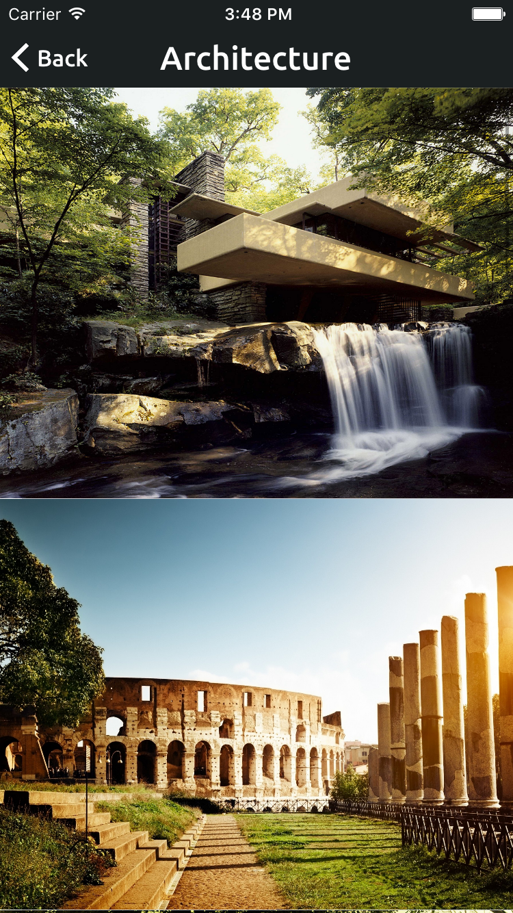
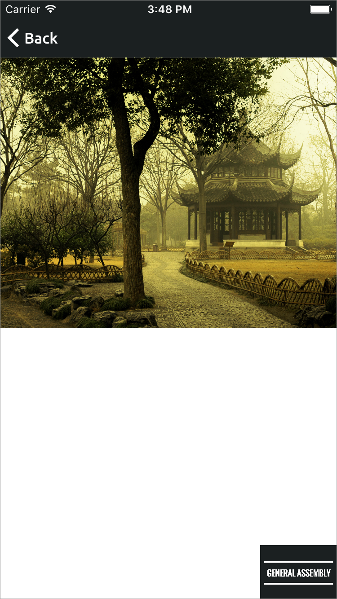
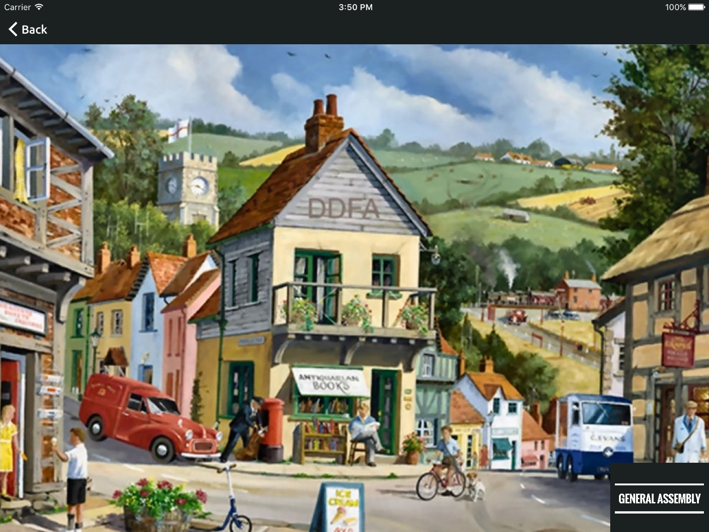

#  Size Classes Lab

## Introduction

#### What we are doing

In this lab, we will practice using Size Classes to design UIs for different screen sizes and orientations.

> ***Note:*** _This lab can be done independently or in pairs._

#### Why we are doing it

Things were simple back when there was just an iPhone. You could make many assumptions about how things would look
on the screen. All of that changed with the introduction of the iPad, iPhone 5, and iPhone 6 devices. There are now
many more screen sizes to design and develop for.

Without Size Classes, you would have to have a different Storyboard for each different screen type. Who wants to do that?

## Exercise

Use Storyboards and Size Classes to change the way an App looks depending on the Size Class.

### Requirements

Open the project in [starter-code](starter-code) and start there.

### Part 1

**iPhone**

</img>

**iPad**

</img>

Make sure the screen above has the following requirements:

The rows have a height of:
+ 300 points for iPhones
+ 350 points for iPhone 6 Pluses in Landscape
+ 400 points for iPads

Font size for the label are:
+ 24 points for iPhones
+ 26 points for iPads

The blue label hangs from the top by:
+ 24 points for iPhones
+ 36 points for iPhone 6 Pluses in Landscape
+ 48 points for iPads

---

### Part 2

**iPhone**

</img>

**iPad**

</img>

Make sure the screen above has the following requirements:

The rows have a height of:
+ 300 points for the iPhones
+ 400 points for iPhone 6 Pluses in Landscape
+ 500 points for iPads

---

For more screenshots, take a look in the [deliverables](deliverables) folder.

### Starter code

Starter code can be found in the [starter-code](starter-code) folder.

### Solution Code

Solution code can be found in [./solution-code](solution-code).

## Deliverables

Turn in your XCode Project and App.

**Verify that**

+ Your App never crashes
+ Your code compiles
+ You tested the App with different devices using the Simulator
+ The design is different on the iPad than it is on the iPhone
+ You used size classes in your Storyboard design
+ You adhered to the design requirements for each screen

---

### Bonus Activities

**iPhone**

</img>

**iPad**

</img>

The screen above has the following requirements:

The main photo has a height of:
+ Half the screen height for iPhones in Portrait
+ Full screen height for iPhones in Landscape
+ Full screen height for iPads

The General Assembly Watermark has a height of
+ 60 points for iPhones
+ 100 points for iPads

---

# Additional Resources

+ [Swift Reference](https://developer.apple.com/library/ios/documentation/Swift/Conceptual/Swift_Programming_Language/GuidedTour.html#//apple_ref/doc/uid/TP40014097-CH2-ID1)
+ [UITableViewController Reference](https://developer.apple.com/library/ios/documentation/UIKit/Reference/UITableViewController_Class/)
+ [UISplitViewController](http://nshipster.com/uisplitviewcontroller/)
