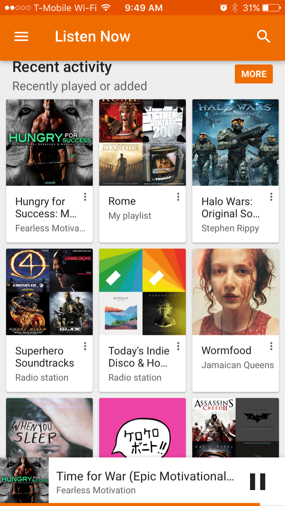
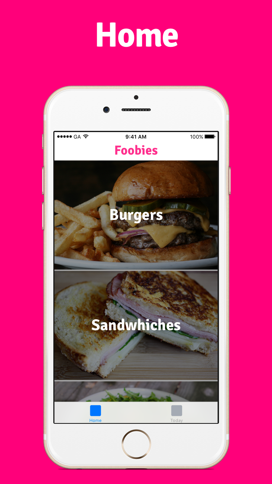
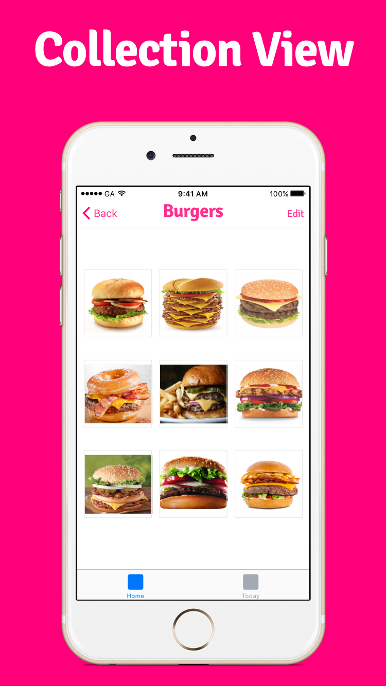
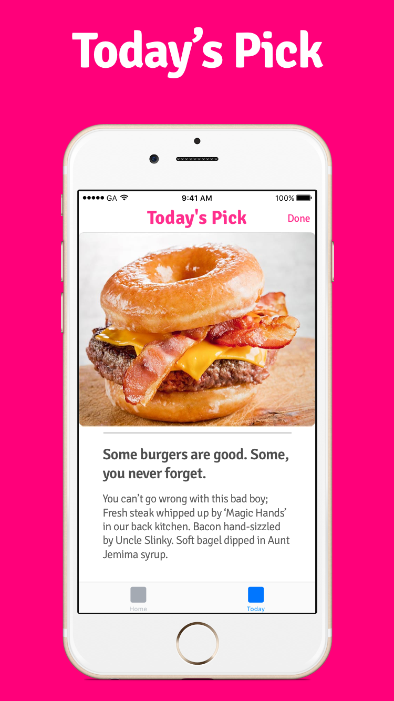
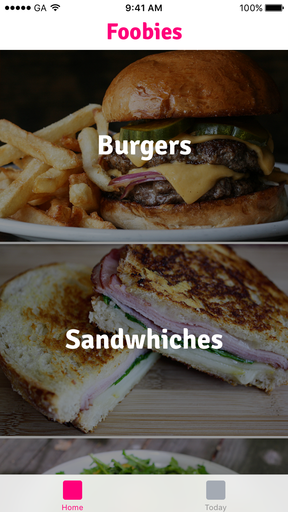
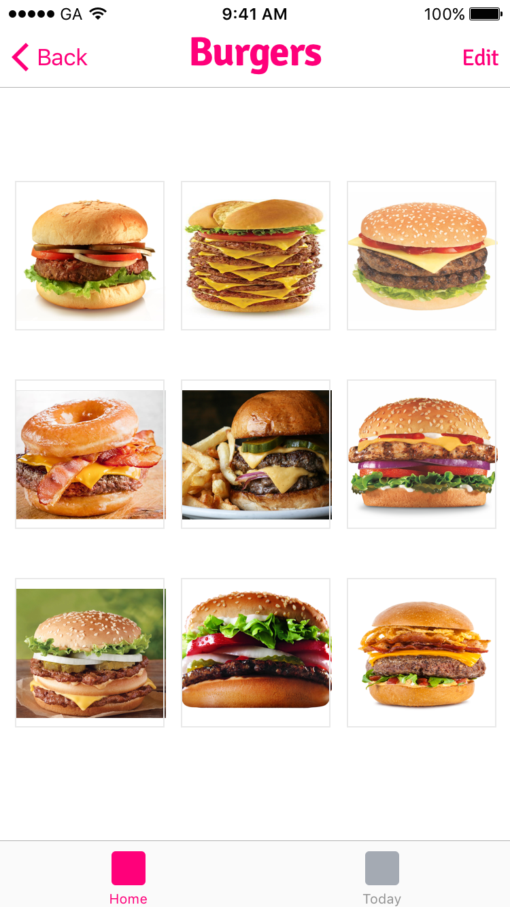
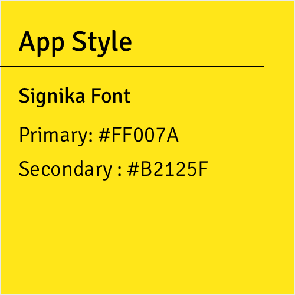

#  Advanced View Controllers Lab

## Introduction

#### What we are doing

In this lab, we will practice making Apps with the `UITableViewController`, `UICollectionViewController`, and `UIPageViewController`.

> ***Note:*** _This lab can be done independently or in pairs._

#### Why we are doing it

Let's face it, the plain Table View looks boring. It doesn't have much style or functionality.
Using custom table views allows you to create apps that look like this:

**UITabBarController**

 </img>

**UICollectionView**

 </img>

---

## Exercise

In this lab, we will create a Foodies App featuring the best food items.

 </img>

---

**Hi-Fi 1**

The Home Screen is a Table View with each food category.

 </img>

**Hi-Fi 2**

Clicking on a food category should take you to a Collection View that shows you at least 9 images of food items from that category.

 </img>

**Hi-Fi 3**

This is the second tab in the Tab View Controller - it picks a random food-of-the-day, giving a picture, a zinger, and a description.

 </img>

---

### Requirements

+ The app should have at 3 categories.

+ Each category should have at least 6 images.

+ Tapping on one image from the Collection View takes you to a full-screen view of that image.

+ Use two custom table cells, one for an image post, and another for a regular text post.

+ The image post can have both an image and a caption.

+ The text post can only have a text post.

+ Use Autolayouts in your to layout UI elements.

> Feel free to use your own images, food items, and descriptions.

### Starter code

There is no started code.

### Solution Code

There is no solution code.

---

## Deliverables

Turn in your XCode Project.

It should look like this:

**Home Screen**

**Collection View**

**Today' Pick**

---

**Verify that**
+ Your App never crashes
+ Your code compiles
+ You used the UITableViewController and have at least 2 tabs
+ You used the UICollectionViewController to display each food item

### Bonus Activities

+ Load images from the Web using URLs instead of including them in the app as assets

+ Adhere to the Style Guide:

    > </img>

+ Do more than 3 food categories

+ Use a UIPageViewController to allow paging between different food items

+ Modify the Collection View to show two burgers per row, instead of three

# Additional Resources

+ [Swift Reference](https://developer.apple.com/library/ios/documentation/Swift/Conceptual/Swift_Programming_Language/GuidedTour.html#//apple_ref/doc/uid/TP40014097-CH2-ID1)
