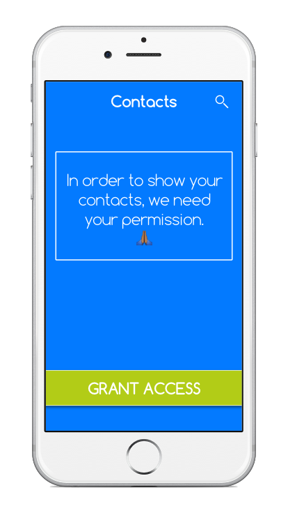
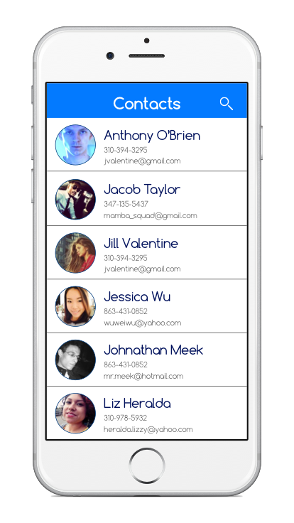
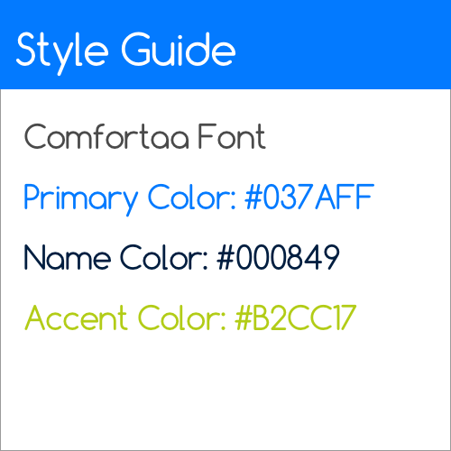
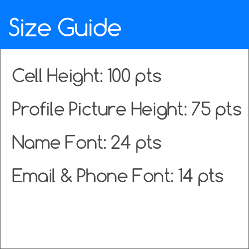
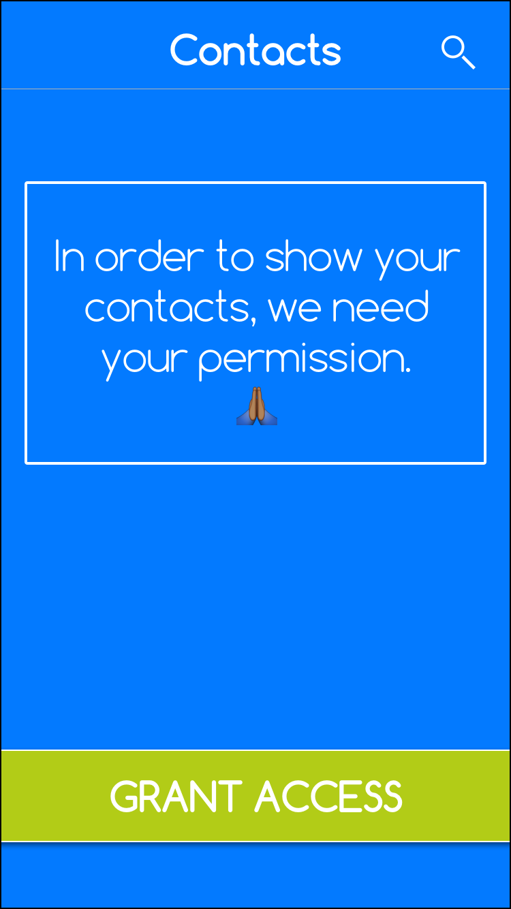
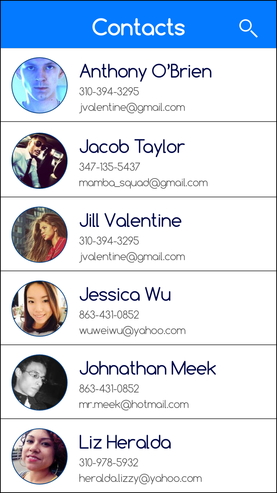
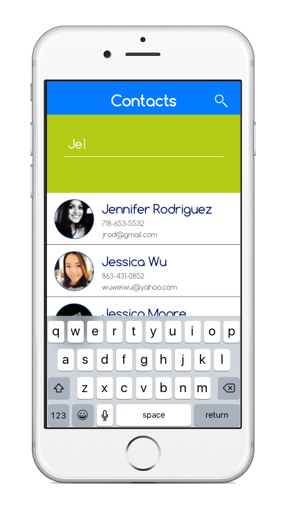

#  App Permissions Lab

## Introduction

#### What we are doing

In this lab, we will practice writing Apps that use or require user permissions.

> ***Note:*** _This lab can be done independently or collaboratively._

#### Why we are doing it

User Privacy and Security is important to Apple, and should be to you as well. iOS allows you access to a user's contacts, personal info, and photo library, but only if the user consents. It is important to take that into consideration when designing user experiences and creating apps.

## Exercise

We will be creating a more interesting Contacts app. You will have to request ask the user for permission in order to access their address book.

**Empty View**

The app should show a message in case the user denied access, with a way to ask the user for permission again.

</img>

**Contact List**

The App should show all of a user's contacts in an alphabetical list.

</img>

>Note: You can sort by either first or last name.

### Requirements

+ Design a flow for getting permission to access a user's contacts
    + Consider the case when a user denies access

+ Create an app that shows a User's contacts

+ For each contact, show the following
    + Full name
    + Picture (if available)
    + Email (if available)

+ Make sure the contacts are displayed alphabetically.

+ Adhere to the Size & Style Guides:

> </img>
 </img>

**Verify that:**

+ Your code compiles.
+ The app does not crash, even when the user denies permission.
+ You used Autolayouts to create the interface.

### Starter code

There is no starter code for this lab.

### Solution Code

There is no solution code provided for this lab.

---

## Deliverables

Turn in your assignment via an XCode project.

They should look like this:

</img>

</img>

</img>

---

### Bonus Activities

+ Make sure that app does not keep requesting permission every time the app starts, even if the user initially denies
access.

+ Use the [Gravatar API](https://en.gravatar.com/site/implement/images/) to load a contact picture
for users

+ Add a search feature that allows searching of contacts by name.
    + Also allows searching by email.
    + Also allows searching by phone number.

    </img>

+ Add a feature that allows a user to record notes about a contact.
    + Make it persist.

# Additional Resources

+ [Official Apple Developer Website](https://developer.apple.com/library/ios/navigation/)
+ [Contacts Framework](https://www.appcoda.com/ios-contacts-framework/)
+ [Gravatar API](https://en.gravatar.com/site/implement/images/)
