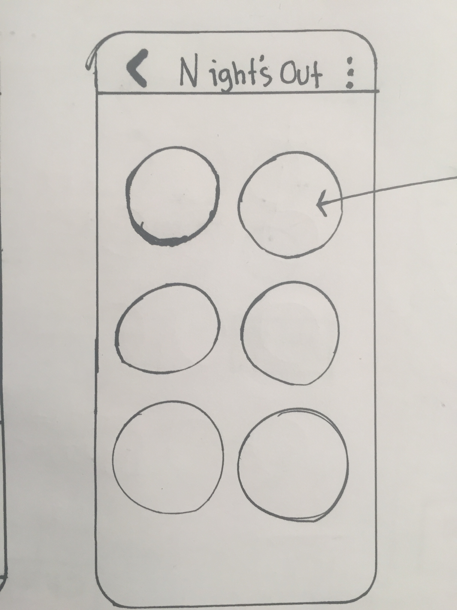

#  Camera/Photo Library Lab

## Introduction

#### What we are doing

In this lab, we will practice loading user images using the `UIImagePickerController`.

> ***Note:*** _This lab can be done independently or in pairs._

#### Why we are doing it

The Camera is one of the iPhone's best features. The `UIImagePickerController` allows you to access a User's Photo Library
and/or Camera. Users can upload their pictures to your app.

## Exercise

In this exercise, we will create a person Photo Album App. It allows a user to create and name an album, and upload pictures to it.

**Low-Fi 1**

 </img>

**Low-Fi 2**

 </img>

---

**Hi-Fi 1**

 </img>

**Hi-Fi 2**

I decided to ditch the circles and go for bigger square images instead.

 </img>

---

### Requirements

+ The first view should be a custom Table View showing each album
  + Include a `+` button with the ability to create an album

+ The second view should be a Collection View with 2-3 pictures per row

### Starter code

There is no started code.

### Solution Code
There is not solution code.

## Deliverables

Turn in your XCode Project.

It should look like this:

> Style Guide:

> </img>

---

**Verify that**

+ Your App never crashes
+ Your code compiles
+ You used at least 2 custom Table View Cells

### Bonus Activities

+ Make the App persist so that Albums and pictures are saved

+ Add the ability to delete an album, and all the pictures in it

+ Add the ability to share a photo or album on social media

+ Use a placeholder image when an album has is empty

+ Adhere to the Style Guide

# Additional Resources

+ [Swift Reference](https://developer.apple.com/library/ios/documentation/Swift/Conceptual/Swift_Programming_Language/GuidedTour.html#//apple_ref/doc/uid/TP40014097-CH2-ID1)
+ [UITableViewController Reference](https://developer.apple.com/library/ios/documentation/UIKit/Reference/UITableViewController_Class/)
