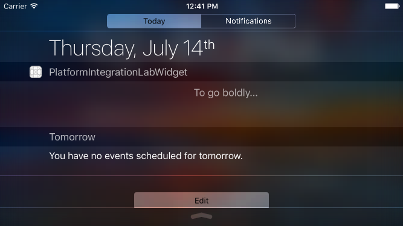

#  Platform Integration Lab

## Introduction

#### What we are doing

In this lab, we will integrate an app with an operating system feature: widgets.

> ***Note:*** _This lab should be done independently._

#### Why we are doing it

Integrating your app with native platform features makes your app more versatile. The extensions and capabilities of an iOS app allow it to appear in more contexts, get information from more places and, overall, provide a richer experience for the user. Familiarizing yourself with one kind of extension will prepare you to take advantage of a wide range of extensions.

## Exercise

+ Create a new project.
+ Make its one scene a full-screen photo.
+ Add a label that shows the current time.
+ Prompt the user to enter text.
+ Create a Today widget extension for the app.
+ Make the widget display whatever text the user entered.

### Requirements

+ The clock must display the correct hour and minute.
+ The user must be able to enter a message in the app.
+ The entered message must appear in the app's widget.

### Starter code

There is no starter code; create a new project.

### Solution Code

Solution code can be found in [solution-code](solution-code).

## Deliverables

Turn in a project that displays the photo-backed main screen and shows the user-provided text in a widget.

The App should look like this:

**Verify that**
+ The widget updates every time the user changes the message

---

### Bonus Activities

+ Give the user an way of selecting a background for the app from a few provided images.
+ Make the selected background image appear in the widget.

---

# Additional Resources

+ [Today Extension and Sharing Data](http://www.glimsoft.com/06/28/ios-8-today-extension-tutorial/)
