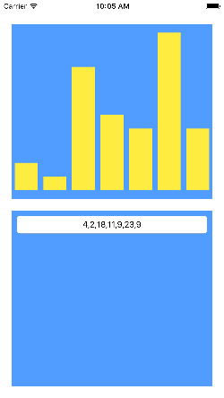
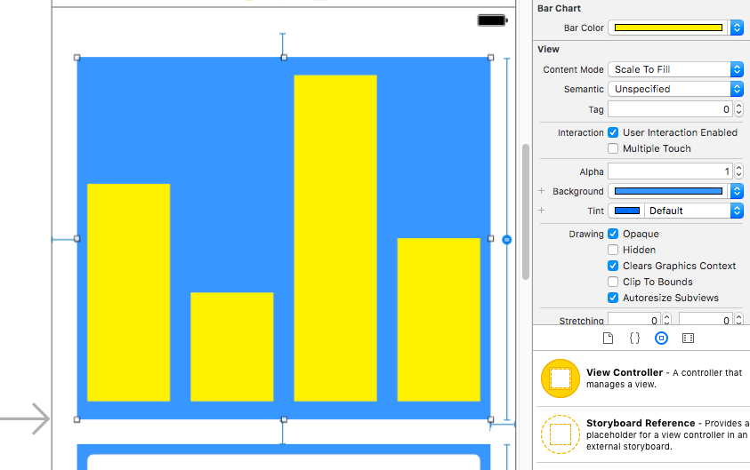

#  Custom UI Views Lab

## Introduction

#### What we are doing

In this lab, we will create a custom subclass of UIView to display a bar chart.

> ***Note:*** _This lab can be done collaboratively or independently._

#### Why we are doing it

Every app needs a distinct look. While many visual elements can be assembled from existing parts of the UIKit framework, subclassing user interface classes allows us to customize elements for our app's unique needs. The more range you have in creating different interfaces, the better.

## Exercise

### Requirements

+ Open the project in [starter-code](starter-code)
+ Create a subclass of UIView called BarChart and set the upper view in the storyboard to that class
+ Override the draw(rect:) method in BarChart to display a bar chart of an array of integers
+ Use @IBDesignable to make the BarChart display its chart in Interface Builder
+ Use @IBInspectable to make the fill color of the BarChart's bars settable in Interface Builder
+ Make text entered in the text field represented in the BarChart (valid text should be integers separated by commas)
+ The BarChart must be a subclass of UIView
+ The BarChart must display a chart in Interface Builder
+ The fill color of bars in the BarChart must be settable in Interface Builder
+ Entering valid data in the text field must result in matching representation in the BarChart

### Starter code

Starter code can be found in the [starter-code](starter-code) folder.

### Solution Code
Solution code can be found in [solution-code](solution-code).

## Deliverables

Turn in a version of the project that has a properly functioning bar chart that displays in Interface Builder.

The app should look like this:

Your view in Interface Builder should look like this:

**Verify that**
+ The BarChart displays properly in Interface Builder
+ The fill color of the bars can be set in Interface Builder
+ Data entered in the text field results in a representative BarChart

---

### Bonus Activities

+ Create a LineChart subclass of UIView that renders the same kind of data as points plotted along a line rather than bars

---

# Additional Resources

+ [Core Graphics Tutorial](https://www.raywenderlich.com/90690/modern-core-graphics-with-swift-part-1)
