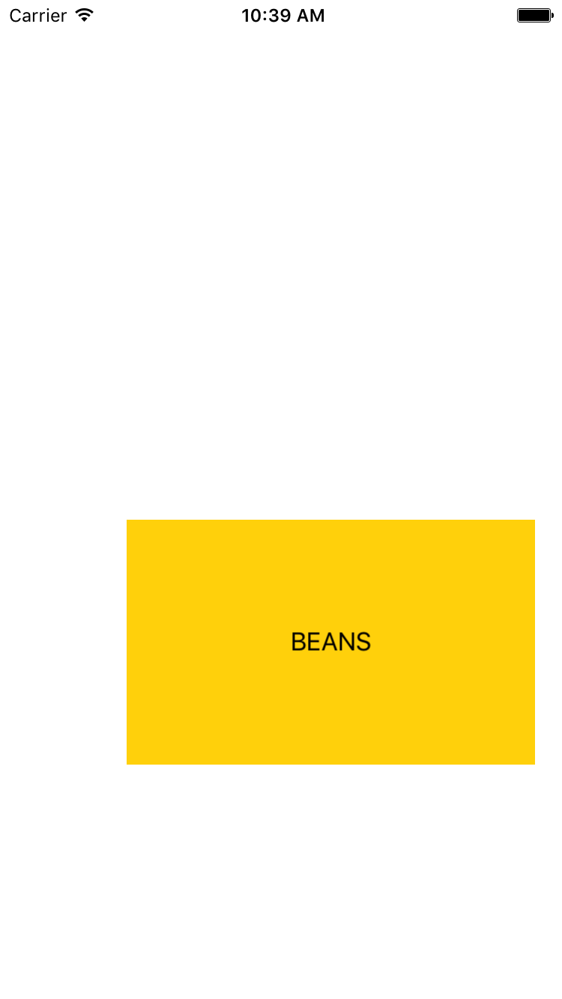

#  Gestures Lab

## Introduction

#### What we are doing

In this lab, we will use gesture recognizers to read touch input.

> ***Note:*** _This lab can be done collaboratively or independently._

#### Why we are doing it

Pre-built buttons and sliders only go so far. Many apps need more customized recognition of user input. With gesture recognizers, we can detect taps, pans, pinches and other gestures. We can give gesture recognition to custom views and get precise information about each gesture made. These abilities greatly expand the possibilities of what our user interface can be.

## Exercise

+ Create a new Xcode project.
+ Add a label to your scene.
+ Use a UIPanGestureRecognizer to make it so that pressing and dragging the label will move it around the screen.
+ Use a UIPinchGestureRecognizer to make it so that pinching and pulling inside the label will adjust the label's size.
+ Make the app respond to shaking the device by reversing the letters in the text of the label.

### Requirements

+ The label must be draggable.
+ The label must be resizable.
+ The label's letters must reverse when the device is shaken.

### Solution Code

Solution code can be found in [solution-code](solution-code).

## Deliverables

Turn in an Xcode project with all the specified gesture functionality.

**Verify that**
+ The gestures are consistently recognized
+ The response to gestures is reasonable (i.e. a pinch to make bigger doesn't cause the label to suddenly cover the whole screen)

Here are screenshots from the solution code app, in which the label can be moved, resized and shaken:

---

### Bonus Activities

+ Make a rotation gesture turn the label.
+ Make a double tap change the label's background color.
+ Make a tap and hold cause the label to shake.
+ Make a 3D touch press cause the label to fade out and in.

---

# Additional Resources

+ [UIGestureRecognizer Tutorial](https://www.raywenderlich.com/76020/using-uigesturerecognizer-with-swift-tutorial)
