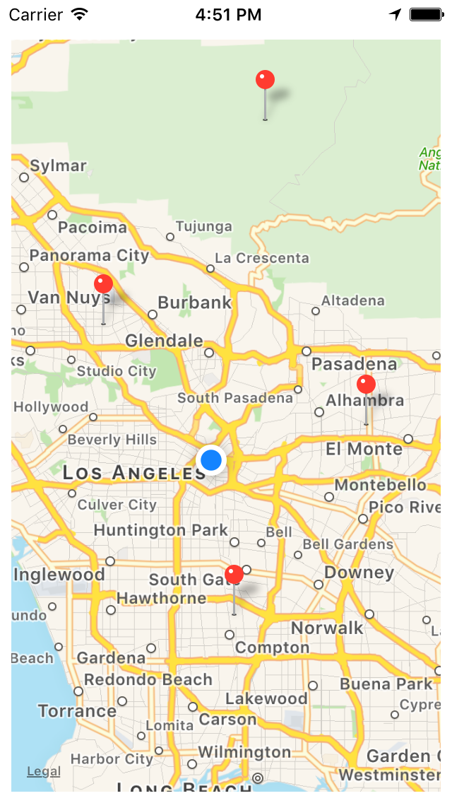

#  MapKit Lab

## Introduction

#### What we are doing

In this lab, we will use the MapKit framework to give an app geolocation functionality.

> ***Note:*** _This lab can be done collaboratively or independently._

#### Why we are doing it

Many of the most popular apps deploy geolocation technology to back essential features. Smart phones connect people to their surroundings in a rich way, adding an information age layer to the world we already live in. Apple's MapKit framework is the most readily accessible geolocation library for an iPhone app, but even you're interested in others, this lab will give you practice with broadly applicable concepts.

## Exercise

### Requirements

+ Open the project in [starter-code](starter-code) and make the first scene request the user's permission to track location
+ Make the first scene move to the second when permission has been granted
+ In the second scene, add an MKMapView
+ Make the MKMapView display the user's current location, focusing on that spot when the scene first appears
+ Make it so that tapping a spot on the map creates an annotation in that spot on the map (visualized by a pin in the map)
+ The app must acquire location-tracking permission before moving on to the scene with the map view
+ The app must display the current user location in the map view
+ The app must create annotations in spots tapped on the map

### Starter code

Starter code can be found in the [starter-code](starter-code) folder.

### Solution Code

Solution code can be found in [solution-code](solution-code).

## Deliverables

Turn in an Xcode project that meets the specified requirements.

The App should look like this:

**Verify that**
+ The app gets permission to track location
+ The map displays user location
+ Annotations appear where the user taps on the map

---

### Bonus Activities

+ Make it so that placing an annotation also plots directions from the user's location to that point.

---

# Additional Resources

+ [Up and Running With MapKit](https://www.hackingwithswift.com/read/19/2/up-and-running-with-mapkit)
