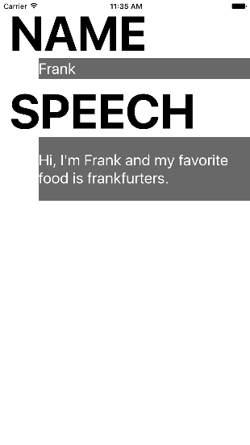

#  Objective-C Lab

## Introduction

#### What we are doing

In this lab, we will bridge Objective-C code with Swift code.

> ***Note:*** _This lab can be done collaboratively or independently._

#### Why we are doing it

Long ago, in the Time Before Time (the 80s), Objective-C was the hip, new way to write object-oriented code. For many years hence, it was the only way to write natively for Apple platforms. The result of this history is that most iOS code is in Objective-C, so as you go about writing new apps and new functionality in Swift, you need to be able to inter-operate with  legacy software written in Objective-C.

## Exercise

In this lab, we will use Objective-C classes in Swift code by way of a bridging header.

### Requirements

+ In the starter code project, gain access to the Objective-C classes using a bridging header
+ In ViewController, set the Name and Speech labels to the name and introduction of a GAProfile object you create
+ In ViewController, have a GAMotionReporter object start logging gyroscopic data

### Starter code

Starter code can be found in the [starter-code](starter-code) folder.

### Solution Code

Solution code can be found in the [solution-code](solution-code) folder.

## Deliverables

Turn in a version of the starter project that displays the name and introduction of a GAProfile, logs gyroscopic data and features a functioning bridging header.

The App should look like this:

---

### Bonus Activities

+ Create a new storyboard (same functionality) in which the view controller is written in Objective-C and the profile class is written in Swift.

---

# Additional Resources

+ [Swift and Objective-C in the Same Project](https://developer.apple.com/library/ios/documentation/Swift/Conceptual/BuildingCocoaApps/MixandMatch.html)
