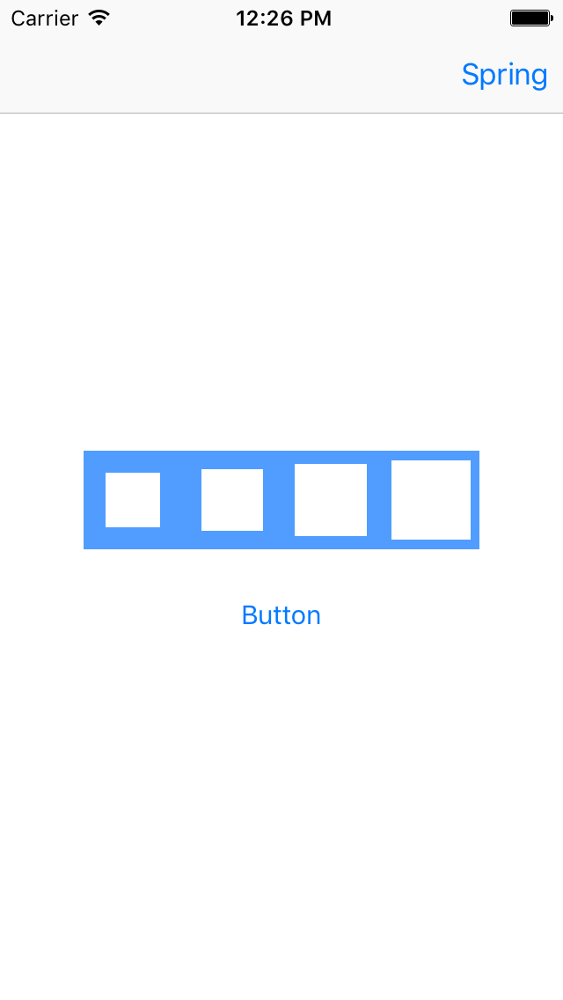

#  UI Animation Lab

## Introduction

#### What we are doing

In this lab, we will animate views using UIKit and a third-party library.

> ***Note:*** _This lab can be done collaboratively or independently._

#### Why we are doing it

Animations add life to an app's user interface. Just as well-chosen icons make your interface more intuitive, animations make it easier for the user to understand what is going on: spinning wheels that mean "loading" or jumping check marks that mean "complete".  Once you become comfortable creating animations and incorporating third-party animation libraries, your visual vocabulary greatly expands.

## Exercise

### Requirements

+ Create a new project
+ Add a button and a set of four UIViews to your app's one scene
+ Use UIKit to make the UIViews animate in a series over the course of a couple seconds when the button is pressed (choose an animation, such as momentarily swelling or fading out and in)
+ Add the library Spring (by Meng To) to your app
+ Add a second scene to the app with the same elements as the first, but this time, animate the views using Spring (try to find a Spring animation that's close to the animations you made with UIKit - it doesn't have to be exactly the same)
+ The views must animate when the button is pressed
+ The views must animate in a series (one starts its animation, then the next starts, etc.)

### Solution Code

Solution code can be found in [solution-code](solution-code).

## Deliverables

Turn in an Xcode project with two scenes: one featuring the required UIKit animations and one featuring the required Spring animations.

Here's an example of what the app could look like:

**Verify that**
+ The UIKit animations happen when the button is pressed
+ The Spring animations happen when their button is pressed

---

### Bonus Activities

+ Play with the controls for your Spring animation, seeking out what you think is the most interesting animation
+ Recreate that interesting animation using UIKit

---

# Additional Resources

+ [Creating Simple View Animations In Swift](http://www.appcoda.com/view-animation-in-swift/)
